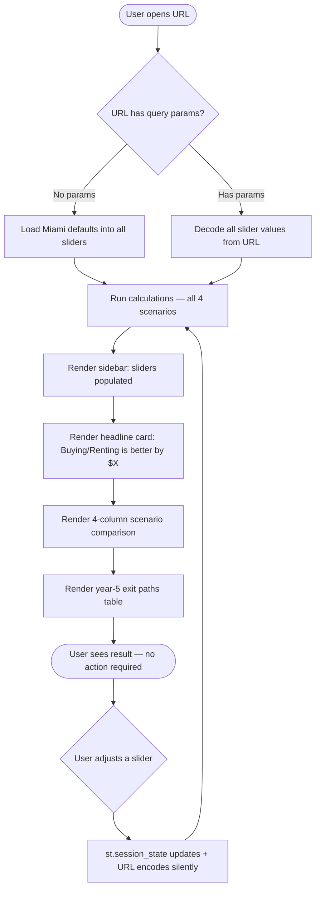
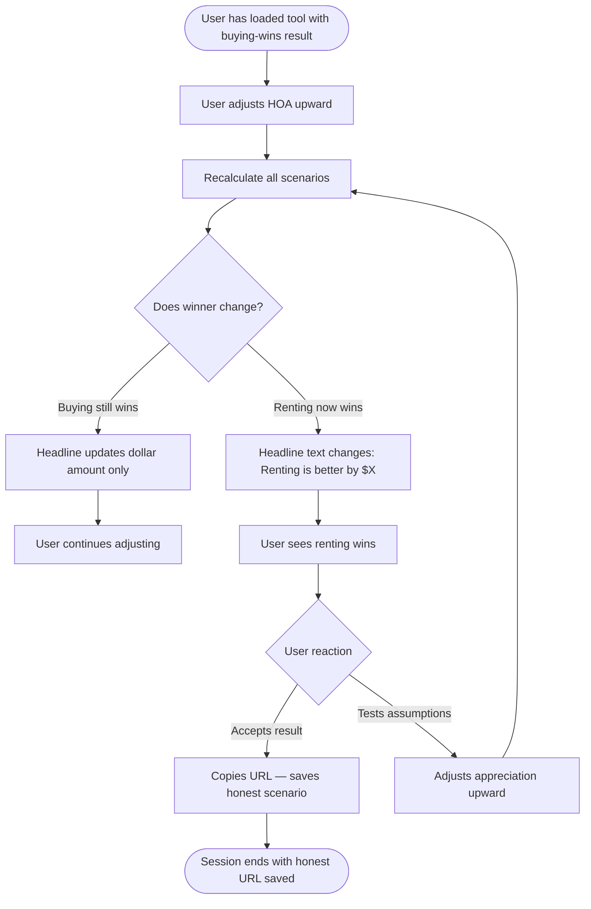
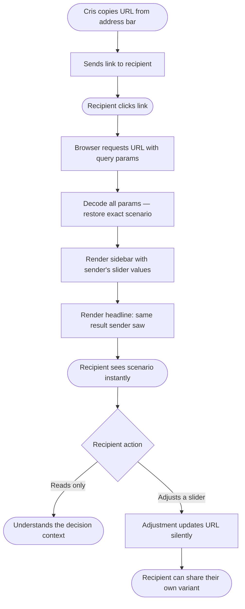
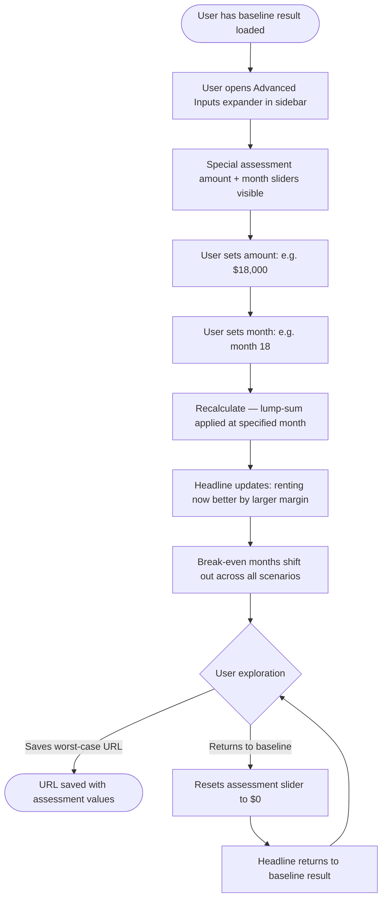

# UX Design Specification — Miami Home Buying Decision Tool

**Author:** Cris
**Date:** 2026-05-22

---

<!-- UX design content will be appended sequentially through collaborative workflow steps -->

## Core User Experience

### Defining Experience

The core loop is a single interaction: drag a slider, watch the headline update. Every other feature — break-even month, net worth table, exit paths — exists to give context to that headline number. If that interaction is instant, legible, and honest, the tool succeeds.

### Platform Strategy

Desktop Chrome, mouse + keyboard, 1280px+ viewport. No mobile, no offline, no touch consideration for v1. Streamlit's reactive rerun model handles the real-time update constraint natively.

### Effortless Interactions

- **First load → meaningful result.** Miami defaults pre-populate everything. The user sees a real headline before touching a single slider.
- **Sharing.** No button, no flow. URL encodes state automatically. Copy the address bar, send it.
- **Understanding "better."** The headline is plain English — "Renting is better by $31,400 over 5 years" — no decoding required for someone who didn't build the tool.

### Critical Success Moments

1. **First load:** Headline is visible, above the fold, with a real number. User knows this isn't a blank form.
2. **First slider drag:** Output updates without page reload. The user feels the tool is live — this is the trust-building moment.
3. **The headline flip:** Renting ↔ buying switches as an assumption changes. This is the moment the user understands what drives the decision.
4. **Link lands correctly:** Recipient opens the shared URL and sees exactly the configured scenario — no setup, no drift.

### Experience Principles

1. **Results before inputs** — headline and key comparison visible first; sliders accessible but not the visual focal point
2. **Everything is live** — no "calculate" button, no page reload; the tool responds to every slider movement
3. **Honest by design** — the UI never visually favors buying or renting; a renting-wins headline looks identical to a buying-wins headline
4. **Defaults earn trust** — Miami-specific defaults must produce a plausible first-load result; a wrong default breaks trust before the user touches anything
5. **Shareable by default** — URL state encoding is invisible infrastructure; sharing is just copying the address bar

## Desired Emotional Response

### Primary Emotional Goals

This is a high-stakes financial decision for a first-time buyer. The emotional design target is not delight or excitement — it is **clarity under pressure**.

- **Clarity** — "I finally understand what this decision actually costs me." The primary payoff is understanding a complex situation, not enjoying the interface.
- **Confidence** — "I trust these numbers." The tool earns credibility through traceability: every output is linked to a visible, adjustable input.
- **Empowerment** — "I control the model." Real-time slider response makes the user feel in command of the analysis, not subject to it.

### Emotional Journey Mapping

| Stage | Target Emotion |
|---|---|
| First load | Relief — "someone built exactly this" |
| First slider drag | Engagement — "I can make this mine" |
| Headline flip moment | Insight — sometimes mixed with discomfort if the tool says renting wins |
| Saving / sharing URL | Satisfaction — "I have this captured, I can come back" |
| Showing someone else | Confidence — "I can explain this decision with data" |

### Micro-Emotions

- **Confidence over skepticism** — every number must be traceable to a visible input; "why did this change?" should always be answerable by looking at the screen
- **Calm over anxiety** — the tool should feel clinical and precise, not alarming; even a $50K renting advantage should be presented matter-of-factly
- **Clarity over confusion** — the headline dominates; detail is available but never forced on first view

### Design Implications

- **Clarity** → strong typographic hierarchy; one dominant headline number per viewport
- **Confidence** → "defaults last updated" date, visible disclaimer, every input labeled with source and units
- **Calm** → neutral color palette; renting-wins and buying-wins states look identical visually — no red/green emotional signaling for outcomes
- **Empowerment** → sliders with real-time feedback, labeled ranges and units, no "calculate" button
- **Avoid overwhelm** → progressive disclosure; Miami defaults produce output before the user touches anything

### Emotional Design Principles

1. **Clinical, not cheerful** — the tone is a trusted calculator, not a product marketing the purchase decision
2. **Neutral on outcome** — renting winning and buying winning must feel identical in the UI; the tool has no stake in the answer
3. **Discomfort is acceptable** — if the math says "don't buy," the tool says so clearly; softening the message would undermine trust
4. **Traceability builds confidence** — every number on screen connects to a slider the user can see and adjust; nothing is hidden

## UX Pattern Analysis & Inspiration

### Inspiring Products Analysis

**New York Times Rent vs. Buy Calculator — gold standard reference**

The closest existing analogue to this tool. What it does exceptionally well:
- **Headline result is immediate and prominent** — the tipping point is above the fold, large, and always live; the user never has to hunt for the answer
- **Editorial neutrality** — backed by NYT's journalistic credibility; genuinely states "rent" when renting wins with no visual bias toward purchase
- **Progressive disclosure** — a simple mode surfaces a handful of inputs; advanced mode reveals the full slider set; users are never confronted with complexity they didn't ask for
- **Grouped, labeled inputs** — sliders are clustered logically (home price, mortgage, taxes, advanced), not presented as one flat undifferentiated list
- **Clean typographic hierarchy** — many numbers, but a clear visual reading order; the eye knows where to go first
- **Journalistic tone** — explanatory copy treats the user as an intelligent adult making a real decision

**Zillow Calculator — useful for contrast**

Useful reference for a simpler baseline:
- Clean, uncluttered first impression; low cognitive load on arrival
- Side-by-side monthly cost comparison (buy vs. rent) lands quickly
- Weakness: Zillow has an implicit stake in buying (monetizes real estate transactions); framing subtly favors purchase; shallower model omits opportunity cost and exit paths

### Transferable UX Patterns

| Pattern | Source | Application |
|---|---|---|
| Headline result above the fold, always live | NYT | "Buying/Renting is better by $X over 5 years" — same treatment, same prominence |
| Progressive disclosure: essential → advanced | NYT | Group sliders into essential (home price, rate, HOA, rent) and advanced (special assessment, landlord inputs, seller costs) |
| Grouped slider sections with clear labels | NYT | 12 sliders organized into logical clusters, not a flat list |
| Editorial neutrality in visual treatment | NYT | Renting-wins and buying-wins headline states styled identically — no color, size, or tone difference |
| Clean typographic hierarchy | NYT | Visual rank: headline > scenario totals > line items > footnotes |
| Monthly cost side-by-side | Zillow | 4-scenario monthly breakdown table borrows this column structure |

### Anti-Patterns to Avoid

- **Framing bias** — any visual cue (color, emphasis, iconography) that telegraphs a preferred outcome undermines the tool's core value proposition
- **Flat slider lists** — 12 unlabeled sliders in a column is a form, not a tool; grouping and labels are mandatory
- **Single-scenario constraint** — both NYT and Zillow show one scenario at a time; the 4-scenario side-by-side view is the primary differentiator and must drive the layout architecture, not be retrofitted into a single-scenario shell
- **"Calculate" button** — requiring a button press to see results creates friction and breaks the "everything is live" principle

### Design Inspiration Strategy

**What to adopt directly:**
- NYT's headline-first hierarchy — result prominent, inputs secondary
- NYT's progressive disclosure model — essential inputs visible, advanced inputs accessible but not forced
- NYT's neutral visual tone — clean, editorial, no emotional color coding for outcomes

**What to adapt:**
- NYT's single-scenario layout → expand to 4-column side-by-side; the column structure is the same, the quantity changes
- Zillow's monthly cost comparison → add exit-path rows beneath the monthly breakdown for the 3 year-5 scenarios

**What to avoid:**
- Any pattern from Zillow or lender-affiliated calculators that visually emphasizes the purchase path
- Any layout that treats 4 scenarios as tabs or sequential views — simultaneity is the differentiator

## Design Direction Decision

### Design Directions Explored

Four layout directions were evaluated via an interactive HTML mockup (`ux-design-directions.html`):

| Direction | Layout approach | Headline position |
|---|---|---|
| 1 · Headline Hero | Full-width headline, comparison below, inputs in expanders | Top, dominant |
| 2 · Split View | Inputs in sticky left sidebar, outputs in main area | Top of main area |
| 3 · Dashboard Dense | Two-column layout, inputs left, all outputs right | Small, top-left |
| 4 · Inputs First | Inputs at top, result and comparison below | Below inputs |

### Chosen Direction

**Direction 2 — Split View**

- Inputs in Streamlit `st.sidebar` — all sliders always visible, grouped into Essential and Advanced sections
- Main area: compact headline card (top), 4-column scenario comparison, year-5 exit paths table
- No expanders required for essential content — everything visible simultaneously at 1280px+
- Advanced inputs (special assessment, landlord scenario, seller costs) in a collapsed expander within the sidebar

### Design Rationale

Cris will use this tool repeatedly as real numbers arrive — HOA disclosures, insurance quotes, updated mortgage rates. Having all inputs accessible without scrolling or expanding matches that repeated-use pattern. The Streamlit sidebar maps naturally to this layout with no hacks required. Shared-link recipients still see the headline near the top of the main area.

Direction 1 (Headline Hero) was the runner-up and remains the right model for the headline treatment — the compact headline card at the top of the main area borrows that approach.

Direction 4 (Inputs First) was ruled out — placing inputs above the headline actively contradicts the "results first" experience principle.

### Implementation Approach

- `st.sidebar`: all slider inputs, grouped with `st.subheader` labels; advanced inputs in `st.expander`
- Main area column 1 (full width): compact headline card via `st.metric` or custom CSS
- Main area columns 2–5: 4-column scenario comparison via `st.columns(4)`
- Exit paths table below scenario grid via `st.dataframe` or custom HTML table
- Streamlit's native sidebar handles the sticky behavior automatically

## User Journey Flows

### Journey 1: First Load → First Result



**UX notes:**
- Steps C→J complete before first interaction — user has a result immediately on load
- URL encoding at step L is invisible; no button press, no confirmation
- The K→L→E loop is the core interaction cycle; Streamlit reruns handle it natively

---

### Journey 1B: The Headline Flip



**UX notes:**
- States F and E look visually identical — same layout, same accent color, only the text changes
- No animation, no warning, no confirmation prompt — the number just changes
- The neutral visual treatment is the entire honesty signal

---

### Journey 3: Shared URL Load



**UX notes:**
- Steps D→H require zero input from recipient — no login, no setup, no session prompt
- Sidebar sliders show sender's values; recipient adjusts freely from that baseline
- Any adjustment creates a new shareable URL automatically

---

### Journey 2: Special Assessment (Advanced Inputs)



**UX notes:**
- Advanced expander is visually separated in sidebar but always accessible — no page navigation required
- Amount + month is the only multi-field interaction in the tool; sidebar groups them naturally
- Reset is dragging the slider back to $0 — no dedicated "clear" button needed

---

### Journey Patterns

**Entry pattern:** Every journey starts identically — URL decode or defaults load, then immediate result. There is no blank state and no onboarding step.

**Feedback pattern:** All output updates are instant and silent. No toasts, no loading indicators, no confirmation dialogs. The number changing is the entire feedback signal.

**Exit pattern:** Every journey ends by copying the URL. No "save," no "export," no account. The address bar is the save mechanism.

**Error pattern:** If a calculation error occurs, display a clear message in the headline card and fall back to the last valid state. Never show a partial or silently incorrect result (NFR10).

### Flow Optimization Principles

1. **Zero steps to first value** — result visible before any user action; Miami defaults do the work
2. **No dead ends** — every slider adjustment is reversible by dragging back; no state requires a "reset" button
3. **Invisible saves** — URL encoding happens on every change; the user never has to think about saving
4. **Progressive complexity** — essential inputs (home price, rate, HOA, rent) are immediately visible; advanced inputs (special assessment, landlord scenario) require one tap to expand but are always reachable

## Component Strategy

### Design System Components (Streamlit Native)

| Component | Used for |
|---|---|
| `st.slider` | All 12 input sliders |
| `st.sidebar` | Left input panel container — sticky by default |
| `st.columns(4)` | 4-scenario comparison grid |
| `st.expander` | Advanced Inputs section in sidebar |
| `st.subheader` | Section labels (Essential Inputs, Advanced) |
| `st.caption` | Footnote text |
| `st.error` | Calculation error fallback display |

### Custom Components

#### HeadlineCard _(highest priority)_

**Purpose:** First thing the user sees; communicates the bottom-line result immediately before any interaction.

**Anatomy:** Label ("At current assumptions") → large dollar amount (accent color) → result text ("Renting/Buying is better by X over 5 years") → best-scenario note ("Best buying scenario: 20% down · Break-even at month 31")

**States:**
- `buying-wins`: dollar amount + "Buying is better by..." text
- `renting-wins`: dollar amount + "Renting is better by..." text
- Both states: visually identical — same layout, same colors, only text changes

**Implementation:** `st.markdown` with injected CSS; dollar amount ~2.5rem, weight 700, color `#2B6CB0`; full-width card with `#F5F7FA` background

#### ScenarioColumn _(one per down payment tier)_

**Purpose:** Monthly cost breakdown and break-even for one down payment scenario.

**Anatomy:** Header (down %, upfront cash required) → monthly total (large) → line items (P&I, PMI, HOA, Property tax, Insurance) → break-even month → optional "Best" badge

**States:**
- `standard`: `#F5F7FA` background, `#D1D9E6` border
- `best`: `#EBF4FF` background, `#2B6CB0` border, "Best" badge visible

**Implementation:** Custom HTML block rendered inside each `st.columns` cell via `st.markdown(unsafe_allow_html=True)`

#### ExitPathsTable

**Purpose:** Year-5 net worth comparison across all 3 exit paths and 4 scenarios.

**Anatomy:** Header row (5%/10%/15%/20%) → Sell row → Rent Out row → Continue Renting row (full-width, accent color, labeled "liquid — investment portfolio")

**Implementation:** Custom HTML table via `st.markdown(unsafe_allow_html=True)`; "Continue renting" row spans all 4 data columns to distinguish it as the renter's alternative

#### DisclaimerBanner

**Purpose:** Permanent disclaimer visible on first load without scrolling (PRD FR31/FR32).

**Anatomy:** Left — "Financial calculator only · No lender affiliation · Not financial advice"; Right — "Defaults last updated: [date]"

**Implementation:** `st.markdown` CSS strip at top of main area; `#EBF4FF` background, `#2B6CB0` text, 12px font

### Component Implementation Strategy

- Custom components implemented via `st.markdown(unsafe_allow_html=True)` — no external React components or third-party libraries
- All design tokens (colors, font sizes) defined once in `config.toml` and referenced in custom CSS strings — no hardcoded hex values scattered through app code
- Custom HTML strings kept in dedicated helper functions in `app.py` to avoid inline HTML clutter

### Implementation Roadmap

**Phase 1 — MVP blockers (build first):**
- `HeadlineCard` — first-load experience depends on it
- `ScenarioColumn` × 4 — comparison display depends on it
- Sidebar slider grouping with `st.subheader` + `st.expander`

**Phase 2 — Required for completeness:**
- `ExitPathsTable` — year-5 exit paths (FR25)
- `DisclaimerBanner` — required by FR31/FR32

**Phase 3 — Polish:**
- "Best" badge CSS refinement
- Break-even month callout styling
- `config.toml` theme token finalization

## UX Consistency Patterns

### Feedback Patterns

| Situation | Pattern |
|---|---|
| Slider moved → calculation updated | Number changes immediately in place. No spinner, no animation, no toast. Speed is the feedback. |
| Headline winner changes direction | Text updates: "Renting is better" ↔ "Buying is better." No color change, no alert. Neutral and instant. |
| Calculation error (edge case) | `st.error` replaces headline card content. Plain English: "Could not calculate at these values — try adjusting [slider]." Last valid state preserved in other outputs. |
| Page cold start (Streamlit Cloud ≤30s) | Streamlit's native spinner is sufficient. No custom loading UI needed. |
| URL encoded | No visual feedback — invisible by design. |

### Input Patterns

- **Slider label format:** Label name left-aligned, current value (`$X,XXX` or `X.XX%`) right-aligned on the same line
- **Range hints:** Min/max values shown as muted text at track ends for inputs where range is non-obvious (e.g., property tax rate, investment return)
- **Two-input grouping:** Special assessment amount + month sit under a single "Special Assessment" subheader with a `st.caption` explaining what it models — the only multi-field interaction in the tool
- **Default signal:** "Miami defaults loaded" caption below the Essential Inputs subheader in the sidebar — signals the tool is pre-configured, not blank

### Number Formatting Patterns

| Type | Format | Example |
|---|---|---|
| Dollar amounts | Nearest dollar, comma separator, $ prefix | `$12,400` |
| Large upfront costs (labels only) | Abbreviated in column headers only | `$45K` |
| Percentages | 2 decimal places, % suffix | `6.50%` |
| Month references | Whole number, "month N" phrasing | `month 31` |
| Negative net worth values | Parentheses, not minus sign | `($4,200)` |

### Outcome Neutrality Rules

- Buying-wins and renting-wins states: identical visual treatment — same font, same color, same layout
- No green for positive outcomes, no red for negative outcomes anywhere in the tool
- The "Best" badge on the winning buy scenario uses accent blue (`#2B6CB0`) — the same color used throughout, not a success green
- Liquid vs. illiquid distinction: conveyed by label text only, never by color

### Display Consistency Rules

- All 4 scenario columns always visible simultaneously — no hiding, disabling, or tabbing between scenarios
- Line items always rendered in fixed order: P&I → PMI → HOA → Property tax → Insurance → Total
- Exit paths always rendered in fixed order: Sell → Rent Out → Continue Renting

## Responsive Design & Accessibility

### Responsive Strategy

Desktop Chrome only for v1. The 4-column side-by-side layout is the core differentiator and requires horizontal space — compressing it to mobile would require tabs or stacked views, breaking simultaneity. Mobile is listed as a Growth Feature in the PRD and deferred intentionally.

| Platform | v1 Scope | Notes |
|---|---|---|
| Desktop Chrome (≥1280px) | **In scope** | Primary target, fully designed |
| Desktop other browsers | Out of scope | No cross-browser testing planned |
| Tablet | Out of scope | Layout requires redesign |
| Mobile | Out of scope | Deferred to Growth Feature phase |

### Breakpoint Strategy

Single threshold: `1280px` minimum recommended viewport (PRD NFR). No responsive layout shifts in v1. At narrower viewports, Streamlit's default horizontal scroll behavior applies — acceptable for a personal tool not publicly indexed.

### Accessibility Strategy

WCAG compliance not required for v1 per PRD. However, Design Direction A color choices produce strong contrast ratios by design:

| Color pair | Contrast ratio | WCAG result |
|---|---|---|
| `#1A1D2E` on `#FFFFFF` | ~17:1 | AAA |
| `#1A1D2E` on `#F5F7FA` | ~15:1 | AAA |
| `#2B6CB0` on `#FFFFFF` | ~5.9:1 | AA |
| `#2B6CB0` on `#EBF4FF` | ~4.7:1 | AA |

No color-only information encoding is used anywhere — outcome direction conveyed in text, liquid/illiquid distinction in labels. These decisions make the tool functionally accessible without explicit compliance effort.

**Keyboard navigation:** Streamlit's native sliders support arrow key interaction by default — no custom implementation needed.

**Screen reader:** Not tested for v1. Custom HTML components via `st.markdown(unsafe_allow_html=True)` should include `aria-label` attributes on headline card and scenario columns as a low-effort improvement.

### Testing Strategy

- **Desktop Chrome:** Manual testing by developer during build
- **Financial accuracy:** Unit tests against reference spreadsheet (NFR5–NFR8)
- **URL state:** Manual round-trip test — encode → copy URL → paste in new tab → verify exact state restored
- No automated accessibility testing or cross-browser testing for v1

### Implementation Guidelines

- Use Streamlit's `st.columns`, `st.sidebar`, and `st.expander` as structural primitives — no custom layout CSS for the page skeleton
- Custom CSS via `st.markdown(unsafe_allow_html=True)` scoped to: HeadlineCard font size, ScenarioColumn card borders, ExitPathsTable row formatting, DisclaimerBanner strip
- Add `aria-label` to custom HTML components at build time — minimal effort, improves screen reader compatibility
- Test at exactly 1280px and 1440px viewport widths during development to verify the 4-column layout holds

## Visual Design Foundation

### Color System

**Direction A — Clean White / Slate** was selected for its editorial authority and alignment with the NYT inspiration reference.

| Token | Hex | Usage |
|---|---|---|
| Background | `#FFFFFF` | Main page background |
| Secondary background | `#F5F7FA` | Input panels, scenario cards |
| Text | `#1A1D2E` | All body text (near-black, slight blue undertone) |
| Accent / primary | `#2B6CB0` | Headline dollar amount, slider handles, expander arrows |

**Outcome neutrality rule:** The accent color (`#2B6CB0`) is used for the headline regardless of whether renting or buying wins. No red/green signaling for outcomes. Both states look identical.

**Streamlit `config.toml` configuration:**
```toml
[theme]
primaryColor = "#2B6CB0"
backgroundColor = "#FFFFFF"
secondaryBackgroundColor = "#F5F7FA"
textColor = "#1A1D2E"
```

### Typography System

- **Base font:** Streamlit default sans-serif (system font stack) — no custom font loading required
- **Headline number:** Bumped to ~2.5rem via custom CSS; weight 700; accent color `#2B6CB0`
- **Headline label text:** ~1rem; weight 400; standard text color
- **Scenario column totals:** ~1.25rem; weight 600; standard text color
- **Line item rows:** ~0.875rem; weight 400; standard text color
- **Disclaimer:** ~0.75rem; weight 400; muted text — visible but not competing with outputs

**Type hierarchy:** Headline dollar → scenario monthly totals → line item breakdown → footnotes/disclaimer. Each level visually distinct; no two levels share the same size and weight combination.

### Spacing & Layout Foundation

- **Base unit:** Streamlit's 8px default spacing — no override needed
- **Layout:** Single main content area; no sidebar. Sidebar adds navigation overhead for a single-page tool and wastes horizontal space needed for the 4-column scenario layout.
- **Column structure:** 4 equal-width columns for scenario comparison; minimum 1,280px viewport before columns compress
- **Input grouping:** Stacked expanders below the comparison section — Essential Inputs (always open on load), Year-5 Exit Paths, Advanced Inputs. Progressive disclosure prevents form overwhelm.
- **Headline panel:** Full-width card with secondary background, centered text, prominent dollar amount — visually separated from both the comparison table and the input section

### Accessibility Considerations

- `#2B6CB0` on `#FFFFFF`: contrast ratio ~5.9:1 — passes WCAG AA for normal text, AA for large text
- `#1A1D2E` on `#FFFFFF`: contrast ratio ~17:1 — passes WCAG AAA
- `#1A1D2E` on `#F5F7FA`: contrast ratio ~15:1 — passes WCAG AAA
- No color-only information encoding — outcome direction conveyed in text ("Renting is better"), not color alone
- No WCAG compliance required for v1 per PRD; contrast ratios documented for reference

## Defining Core Experience

### Defining Experience

**"Adjust one assumption and watch the whole picture shift."**

The core interaction is a feedback loop. The user brings their real situation — a specific HOA quote, an insurance estimate, their personal risk tolerance on appreciation — adjusts a slider, and the full financial landscape immediately reorganizes around that input. The tool does not tell users what to think; it shows exactly what drives the answer.

### User Mental Model

Users arriving from mortgage calculators carry this expectation:
- "I type numbers and press a button to see a payment"
- "Results update only when I ask"
- "I'll see one scenario at a time"
- "Opportunity cost is not part of this calculation"

The gap between that expectation and this tool's behavior is intentional and valuable — but it must be bridged immediately on first load, not explained. Miami defaults pre-populate everything and the headline is live on arrival. The user sees "Renting is better by $12,400 over 5 years" before touching a single slider. That single fact establishes: this tool already has an opinion; I didn't have to ask for it; now I can interrogate it.

### Success Criteria

- User adjusts any slider and sees the headline update within 1 second
- User understands "better by $X over 5 years" without tooltip or explanation
- User can identify which input changed the headline
- User feels confident enough to share or save the URL — copying the link is the natural "I'm done here" signal

### Novel vs. Established Patterns

| Interaction | Classification | Implication |
|---|---|---|
| Slider → real-time result | Established (NYT precedent) | No user education needed |
| 4 scenarios simultaneously | Novel | Layout must make the comparison self-evident — no "how to read this" required |
| Year-5 net worth exit framing | Novel vs. monthly cost framing | Brief label copy does the work ("Your financial position at year 5") |
| URL = saved scenario | Established | No explanation needed; sharing is intuitive |

### Experience Mechanics

**1. Initiation**
Page loads with Miami defaults set. Headline is visible immediately — "At these assumptions, [X] is better by $Y over 5 years." No button to press. The user is already in the tool.

**2. Interaction**
User drags a slider. System recalculates across all 4 scenarios in under 1 second. Headline reflects the dominant winner at current assumptions. The 4-column table updates simultaneously — all columns live, none ahead of others.

**3. Feedback**
The headline number changes. If the winning scenario shifts (e.g., from 15% down to 20% down), the headline text changes to reflect it. No animation, no loading spinner — the number becomes a new number. The speed itself is the feedback: this is a real-time model, not a form.

**4. Completion**
No formal completion state — the tool is exploratory by design. The user-defined "done" signal is copying the URL. The address bar silently encodes the current scenario throughout the session. No "save" button, no confirmation — the link is always ready.

## Design System Foundation

### Design System Choice

**Streamlit native theming + targeted custom CSS**

Streamlit's component model constrains design system choice — traditional web frameworks (Material UI, Chakra, Tailwind) are React ecosystems and do not apply directly. The right approach for this project is Streamlit's built-in theming configured via `config.toml`, with custom CSS injected via `st.markdown` reserved for specific hierarchy overrides.

### Rationale for Selection

- **Solo developer, personal tool** — low maintenance overhead is a priority; native theming requires no additional dependencies and survives Streamlit version updates cleanly
- **NYT-inspired aesthetic** — Streamlit's default light theme with a custom neutral palette achieves the clean, editorial tone without custom component development
- **No brand guidelines** — full design token freedom within Streamlit's theming API
- **Avoiding brittle overrides** — custom CSS via `unsafe_allow_html` is reserved for targeted use; broad CSS overrides break unpredictably on Streamlit updates

### Design Tokens

| Token | Decision | Rationale |
|---|---|---|
| Background | Off-white / white | Editorial, not clinical |
| Text | Near-black | High contrast, neutral |
| Accent (headline) | Mid-blue or slate — not red or green | Avoids emotional outcome signaling |
| Typography | Streamlit default sans-serif; headline bumped via custom CSS | Serviceable without custom font loading |
| Layout | Main content area, no sidebar | Sidebar adds navigation overhead for a single-page tool |

### Implementation Approach

- `config.toml` defines color palette, base font, and widget defaults
- Streamlit native components (`st.metric`, `st.columns`, `st.slider`, `st.expander`) cover primary UI needs
- Custom CSS via `st.markdown(unsafe_allow_html=True)` used only for: headline font size, table row styling, disclaimer visual treatment
- Third-party Streamlit component libraries (`streamlit-extras`, etc.) avoided unless a native limitation blocks a specific feature

### Customization Strategy

No external design system to customize. Design consistency maintained through:
- Centralized `config.toml` for all color and font tokens
- Consistent use of Streamlit column widths and spacing across all 4 scenario columns
- Headline styled identically regardless of whether renting or buying wins — outcome neutrality enforced at the component level

## Executive Summary

### Project Vision

A single-page Streamlit tool that gives a first-time Miami buyer the full, unbiased financial picture of the rent-vs-buy decision — not just the monthly payment, but every cost, every exit path, all 4 down payment scenarios simultaneously. The headline result flips in real time as the user adjusts assumptions. Any scenario is shareable via a single URL with no account or backend required.

The defining principle: if renting wins, the tool says so. No lender affiliation, no bias toward purchase.

### Target Users

**Primary — Cris (first-time Miami buyer)**
Financially literate, not a finance professional. Uses Chrome on desktop. Wants the math to be honest even when the answer is uncomfortable. Needs a confident decision before early 2027. Will return to the tool multiple times as real numbers (HOA disclosures, insurance quotes, interest rate changes) come in.

**Secondary — Shared-link recipients (family, partner, realtor)**
Zero-friction entry required: no account, no setup. They open a URL, see the scenario as Cris configured it, and can adjust sliders freely. The tool needs to be self-explanatory within 30 seconds for someone who didn't build it.

### Key Design Challenges

1. **Information density vs. legibility** — 4 scenarios × 3 exit paths × ~10 output lines equals 120+ data points on one page. The layout must make the comparison scannable and not overwhelming; hierarchy and grouping do the heavy lifting.
2. **The emotional arc of the tool** — the tool sometimes delivers unwelcome news. The UX must feel authoritative and neutral — not discouraging, not biased. The "headline flip" moment (renting wins ↔ buying wins) is a high-tension interaction that needs to feel like a trustworthy calculator, not a verdict.
3. **12+ sliders without slider fatigue** — Miami defaults must do most of the work on first load so the user sees meaningful output before touching anything. Slider grouping and progressive disclosure prevent the input section from feeling like a form.

### Design Opportunities

1. **Headline as the hero** — "Buying at 15% down is better by $8,200 over 5 years" should be the first thing visible, large, always live. Most calculators bury the bottom line; surfacing it immediately is the core differentiator.
2. **Side-by-side is the feature** — no other free tool shows 4 down payment scenarios simultaneously without re-entry. The layout architecture itself communicates the tool's value before the user reads a word.
3. **Shared URL as a conversation tool** — when a link recipient lands on the page, they should immediately see the headline, understand the framing, and be able to adjust without needing Cris to explain anything. The tool becomes a shared reference point in a conversation, not just a calculator.
